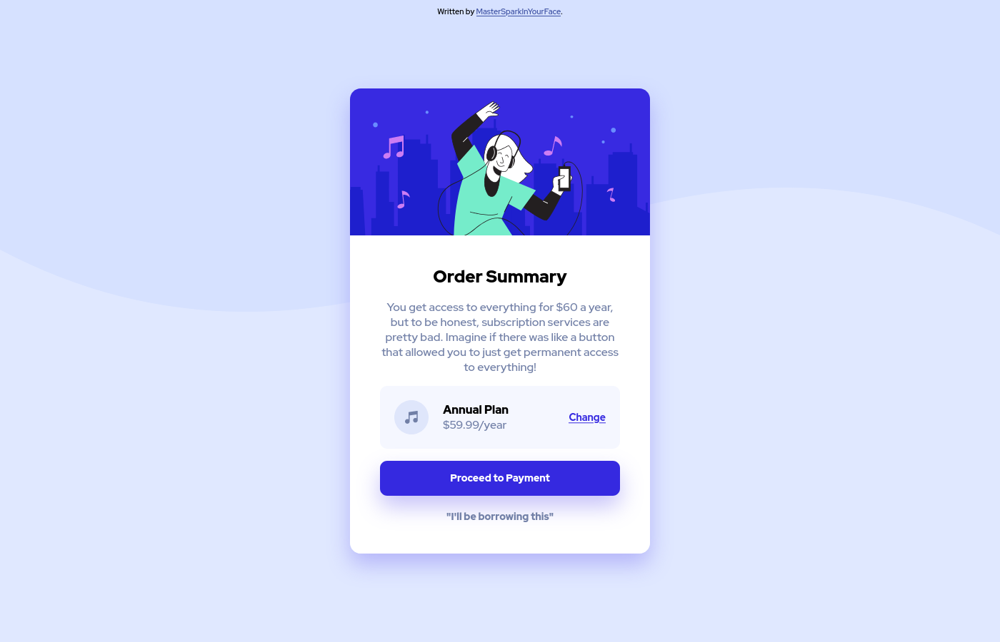
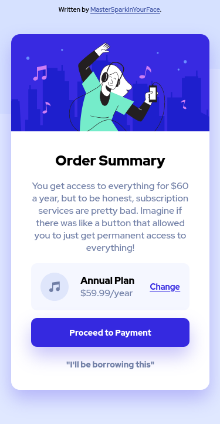

# Frontend Mentor - Order summary card solution

This is a solution to the [Order summary card challenge on Frontend Mentor](https://www.frontendmentor.io/challenges/order-summary-component-QlPmajDUj).

## Overview

### Screenshots (desktop and mobile viewports)

### Built with

- HTML 5
- CSS 3
- Weird flex

### Resources

- [MDN](https://developer.mozilla.org/): A useful reference on all things web as always
- [flex guide](https://css-tricks.com/snippets/css/a-guide-to-flexbox/): one of the first results when searching for flexbox info.
